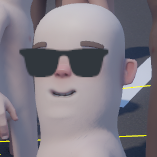

  

# Awesome S&Box

# Facepunch Games
These games are made by Facepunch and are often updated
* [Sandbox](https://github.com/Facepunch/sandbox) - Garry's Mod in S&Box
* [Hidden](https://github.com/Facepunch/sbox-hidden) - Players have to eliminate an invisible enemy with a knife
* [RTS](https://github.com/Facepunch/sbox-rts) - Real-time strategy game
* [Pool](https://github.com/Facepunch/sbox-pool) - Also known as billiard
* [Sandblox](https://github.com/Facepunch/sandblox) - Voxels in S&Box
* [AI Lab](https://github.com/Facepunch/sbox-ai-lab) - Tests for AI controlled NPCs
* [DM98](https://github.com/Facepunch/dm98) - Classic deathmatch
* [sbox-minimal](https://github.com/Facepunch/sbox-minimal) - Everything you need to create your own addon

# Third-party Games
* [S&Saber](https://github.com/Ryhon0/sandsaber) - Beat Saber in S&Box
* [Gun Game](https://github.com/Ryhon0/sbox-gg) - Gun Game in S&Box
* [TTT Reborn](https://github.com/TTTReborn/ttt-reborn) - Spiritual successor of Trouble in Terrorist Town\
* [Team Fortress Source 2](https://github.com/rob5300/Team-Fortress-Source-2) - Team Fortress 2 in S&Box
* [DVD](https://github.com/rndtrash/dvd) - Bouncing DVD logo
* [YourRP](https://github.com/d4kir92/sbox-yourrp) - Generic RP game
* [Chloride](https://github.com/WYVERN2742/Chloride) - High Octane Hovercraft Shooter
* [Murderbox](https://github.com/TylerJaacks/murderbox) - Garry's Mod Murder in S&Box.

# Libraries
* [Sandbox.System](https://github.com/Ryhon0/Sandbox.System) - Sandbox wrappings to C#'s standard libraries for porting existing libraries with minimal effort
* [Advisor](https://github.com/game-creators-area/Advisor) - Administration framework for S&Box
* [sbox-voxel](https://github.com/TankNut/sbox-voxel) - A set of library classes for s&box to create runtime voxel models

# Weapons
* [Ryhon's Weapon Base](https://github.com/Ryhon0/RWB) - Simple weapon base with support for semi and fully automatic weapons, shotguns, melee, burst fire and projectiles all at the same time
* [Simple Weapon Base](https://github.com/timmybo5/simple-weapon-base) - Weapon base with support for multiple weapon types, tucking and akimbo weapons

# Contributing
Don't see a project that you like here? Fork this repository and add it to the list, then create a pull request. The project has to be open-source and work and be actively updated.   
Is any of the information here incorrect? Would you like to add something? PRs are welcome.  
This repo is not limited just to code, free materials, models and maps are welcome too!  
Those assets need to include the project file (e.g. .blend file, hammer map file)
